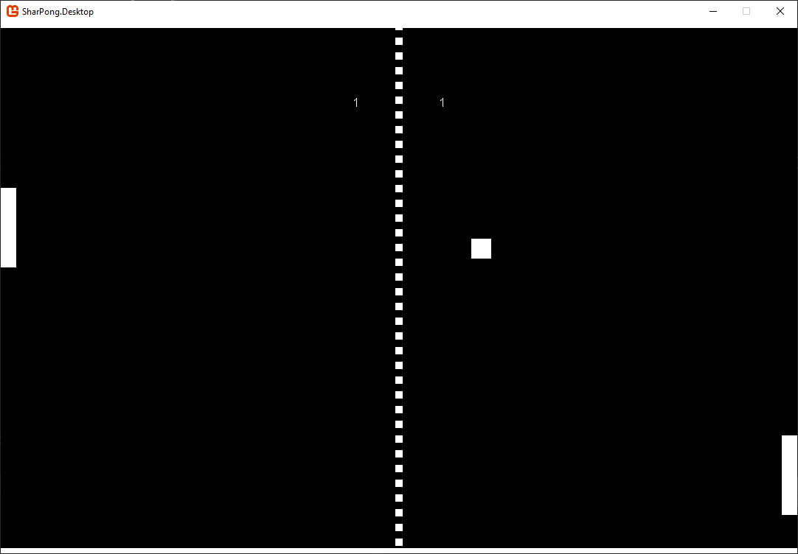

# Pong Clone in C# and Monogame

Simple pong clone in C# and Monogame that I made for fun, It was kinda fun, but I didn't like C# that much and having to work with visual studio was pain in the #$@#$.

*Here's a picture of the game running:*

